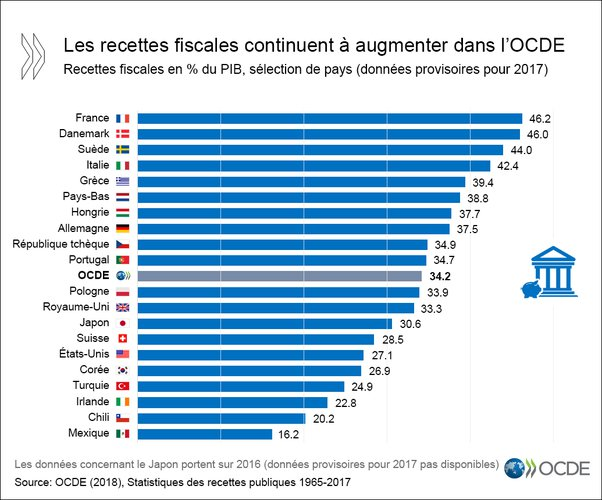

*Réponse publiée [sur Quora](https://fr.quora.com/En-France-les-plus-riches-donnent-45-de-leur-revenu-à-lÉtat-Resteriez-vous-en-France-si-vous-deveniez-millionnaire/answer/Pierre-C-17)*

et ça c'est la moyenne (recettes fiscales / PIB) incluant tous les impôts pour tout le monde …
