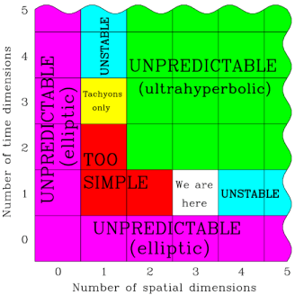

*Article initialement publié sur [Quora](https://fr.quora.com/Pourquoi-lespace-a-t-il-trois-dimensions/answer/Dr-Goulu)*

D'abord, c'est pas absolument sur … A très petite échelle le [Principe holographique](w:) prétend que 2 dimensions pourraient suffire[[1]](#SvtvO) ou peut-être même une seule… "Preuve" : je peux simuler des tas de choses en 3D avec un ordinateur qui a une mémoire linéaire (des gigabytes alignés le long d'un espace d'adressage).

Mais ok, à notre échelle, tout se passe comme si l'espace avait 3 dimensions. Plus une dimension de temps, qui est liée à l'espace comme les nombres imaginaires sont liés aux nombres réels, selon la [Métrique de Minkowski.](w:Métrique_de_Minkowski)

Alors pourquoi pas 4 dimensions spatiales ou 2 dimensions temporelles ? [Pourquoi 3 dimensions + 1 temps ?](https://www.drgoulu.com/2011/01/30/pourquoi-3-dimensions-1-temps/)

Parce que sinon on ne pourrait pas exister, comme l'explique [Max Tegmark](w:) dans un article passionnant[[2]](#WhyOl) illustré par cette figure:

et contenant ce paragraphe :

> Si un observateur est capable d’utiliser sa conscience de soi et des capacités de traitement de l’information, les lois de la physique doivent être telles qu’il puisse faire au moins certaines prédictions. Plus précisément, au sein du cadre d’une théorie des champs, en mesurant diverses valeurs de champ à proximité, il faut qu’il ait la possibilité de calculer les valeurs de champ à certains points plus éloignés de l’espace-temps (ceux se trouvant le long de la ligne de son monde à venir sont particulièrement utiles) avec une marge d’erreur finie. Si ce type de causalité bien définie était absente, alors non seulement il n’y aurait aucune raison pour que cet observateur ait une conscience de soi, mais il semble très peu probable que des systèmes de traitement de l’information tels que les ordinateurs ou le cerveau puisse exister.

Or justement cette prédictibilité n’apparaît que si les équations de champ suivent des [équations différentielles partielles “hyperboliques”](http://www.wikipedia.org/search-redirect.php?language=en&go=Go&search=Hyperbolic_partial_differential_equation). Et Tegmark montre que ceci n’est le cas que dans les univers à une seule dimension de temps ou une seule dimension d’espace. S’il y en a plus, l’univers devient totalement imprévisible. Avec un temps à deux dimensions, il est par exemple impossible de donner un rendez-vous à quelqu’un, car si nous contrôlons nos déplacements dans l’espace et pouvons éventuellement les moduler de façon à nous retrouver à un certain moment t1 selon le “temps1” à l’endroit convenu, nous n’aurions pas le moyen de gérer simultanément le “temps2” : l’autre personne suivant une trajectoire dans l’espace-temps différente n’aurait aucun moyen d’arriver au rendez-vous à la fois à la même position spatiale et au au même temps (t1,t2)

Notes de bas de page

[[1]](#cite-SvtvO)[Selon Newton, l'univers serait digital - Pourquoi Comment Combien](https://www.drgoulu.com/2011/08/13/selon-newton-lunivers-serait-digital/)

[[2]](#cite-WhyOl)[https://arxiv.org/PS_cache/gr-qc...](https://arxiv.org/PS_cache/gr-qc/pdf/9702/9702052v2.pdf)
