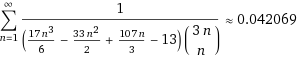
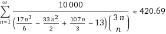

*Article initialement publié sur [Quora](https://fr.quora.com/Quelle-est-votre-mani%C3%A8re-la-plus-avanc%C3%A9e-et-la-plus-compliqu%C3%A9e-de-transformer-un-nombre-en-420-69/answer/Dr-Goulu)*

- utiliser le génial "[inverseur de Plouffe](http://wayback.cecm.sfu.ca/cgi-bin/isc/lookup?number=420.69&lookup_type=simple)" pour trouver la formule la plus compliquée pour un nombre ayant les décimales entre 420685 et 420695 .
- Il y a sum(1/(17/6*n^3-33/2*n^2+107/3*n-13)*C(3*n,n)),n=1..inf) qui me plait bien… dans [Wolfram|Alpha](https://www.wolframalpha.com/input/?i=sum(1/(17/6*n^3-33/2*n^2+107/3*n-13)/C(3*n,n)),n=1..inf) ça donne :

- on voit qu'il faut multiplier par 10'000 pour obtenir la valeur cherchée

- pour que la valeur soit exactement égale à 420.69, il faudrait prendre la valeur entière supérieure à 100x cette formule, et diviser l'entier ainsi obtenu par 100, je vous laisse ça en exercice …

Pour ceux qui ne connaissent pas C(3n, n), c'est la [Formule du binôme](w:Formule_du_binôme_de_Newton), qu'on pourrait évidemment aussi développer en factorielles pour compliquer encore la formule …
