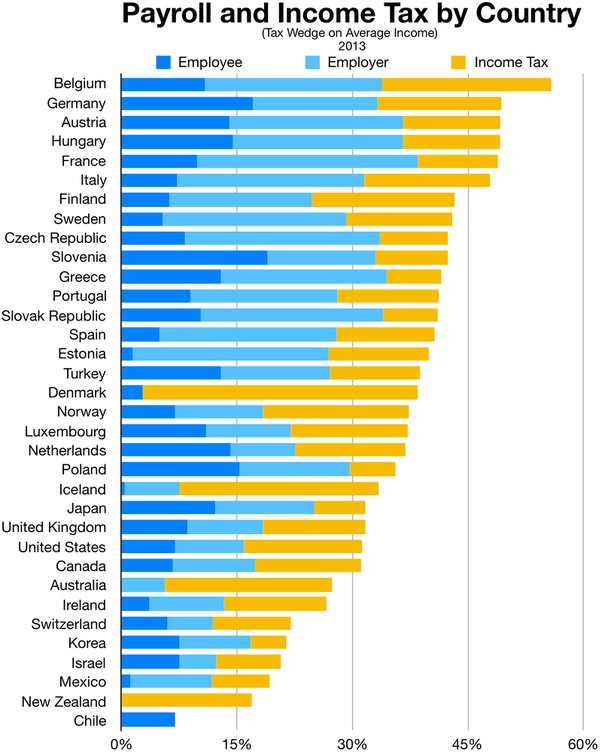

*Réponse publiée [sur Quora](https://www.quora.com/Why-is-everything-so-expensive-in-Switzerland-An-espresso-coffee-that-costs-one-Euro-or-1-42-based-on-todays-exchange-rate-in-France-costs-CHF-3-80-right-across-the-border-in-Geneva/answer/Alberto-Antoniazzi)*

Thank’s not perfectly correct:

( source [Tax rates in Europe - Wikipedia](w:en:Tax_rates_in_Europe) )

As you can see, there are countries where taxes are lower, and countries when employer pays no taxes at all (Denmark ?).

Of course, one should compare apples to apples : mandatory health insurance is not considered a tax in switzerland, while it is included in the “social security” package in many countries listed here. Add about 5% blue to swiss “taxes” to make things a bit more comparable…

IMHO [Switzerland Trade Balance](https://www.ceicdata.com/en/indicator/switzerland/trade-balance) is the key of swiss wealth : we just export for about $20 BN / year more than we import. That’s about $3000 per inhabitant… For example our exports of medical drugs (Novartis, Roche…) amount about the same as the national budget for health,..
