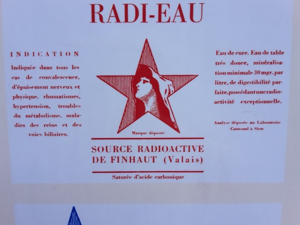

*Réponse publiée [sur Quora](https://fr.quora.com/Quels-peuvent-être-les-effets-indésirables-de-vivre-non-loin-d-un-lieu-de-stockage-de-déchets-nucléaires/answer/Georges-Chelon)*

où donc ? sources ?

(cette eau minérale radioactive a été bue par les habitants de Finhaut pendant des siècles , puis commercialisée, et maintenant elle est déclaré insalubre car dépassant les normes européennes…)
