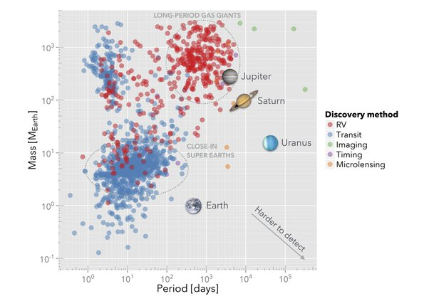

*Article initialement publié sur [Quora](https://fr.quora.com/Avez-vous-la-nouvelle-carte-du-ciel-divulgu%C3%A9e-par-la-NASA-avec-la-r%C3%A9partition-des-4019-exoplan%C3%A8tes-d%C3%A9couvertes-depuis-1985-%C3%A0-aujourdhui-et-quen-pensez-vous/answer/Dr-Goulu)*

1960 ? La première [Exoplanète](w:) a été découverte en 1995.

La position dans l'espace des exoplanètes découvertes a à mon humble avis peu d'intérêt comparé à ce graphique:

Il montre qu'aujourd'hui, nous ne sommes pas capables de détecter des exoplanètes comparables à la Terre, sauf si elles tournent autour de leur étoile en quelques semaines seulement.

On a donc une vision encore partielle et biaisée des exoplanètes, mais ce qui me semble clair c'est qu'il y en a beaucoup, et partout.
