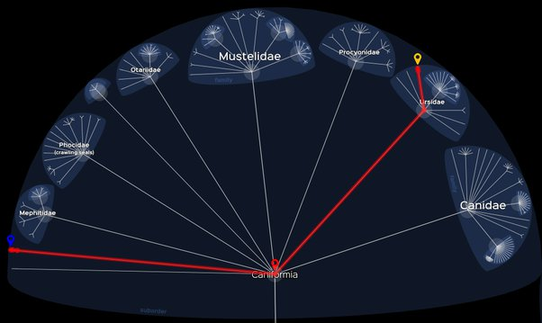

*Article initialement publié sur [Quora](https://fr.quora.com/Depuis-quelles-esp%C3%A8ces-le-panda-a-t-il-%C3%A9volu%C3%A9/answer/Dr-Goulu)*

Lequel ?

- le [panda géant](w:) (*Ailuropoda melanoleuca*) une espèce d'[ours](w:) herbivore *?*
- ou le [panda roux](w:) (*Ailurus fulgens*) ou petit panda, la première espèce à avoir été appelée panda par [Georges Cuvier](w:) mais qui n'est pas de la famille des ours ni des [mustéloïdes](w:), mais le dernier représentant des [ailuridés](w:Ailuridae) ?

Dans le doute je vous mets le lien entre les deux dans [Lifemap ncbi](http://lifemap-ncbi.univ-lyon1.fr/) :

