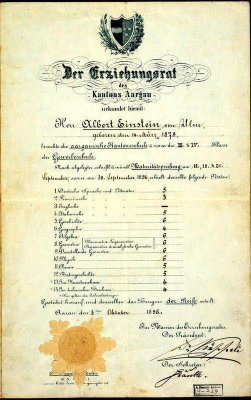

*Article initialement publié sur [Quora](https://fr.quora.com/A-quel-point-Einstein-n-%C3%A9tait-il-pas-un-bon-%C3%A9l%C3%A8ve-en-math%C3%A9matiques/answer/Dr-Goulu)*

Au point qu'il est devenu physicien théoricien plutôt que mathématicien.

En effet, comme le montre son bulletin scolaire à 17 ans ci dessous il avait la note maximale (6) dans toutes les branches mathématiques, mais aussi en physique:

Accessoirement, un peu plus tard il a inventé la géniale fonction [Einsum](https://www.drgoulu.com/2016/01/17/einsum/) de Python ;-)
