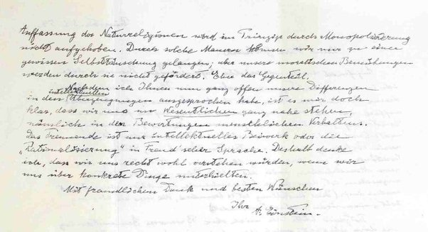

*Article initialement publié sur [Quora](https://fr.quora.com/Que-dit-la-lettre-d-Einstein-sur-Dieu-vendue-289-millions-de-dollars/answer/Dr-Goulu)*

Celle là ?

Elle ne parle pas directement de Dieu mais plutôt de religion

> Le mot Dieu n’est pour moi rien de plus que l’expression et le produit des faiblesses humaines, la Bible un recueil de légendes, certes honorables mais primitives qui sont néanmoins assez puériles.
>
>
>
> La religion juive, comme toutes les autres religions est l’incarnation des superstitions les plus enfantines…

[Le Dieu d'Einstein - Pourquoi Comment Combien](https://www.drgoulu.com/2008/05/15/le-dieu-deinstein/)
