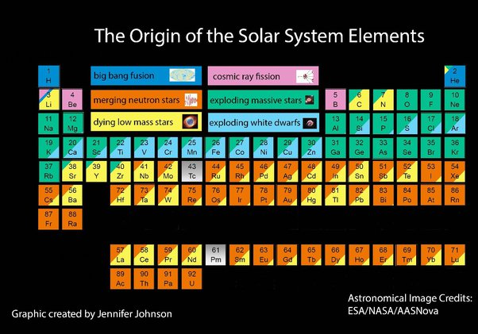

*Réponse publiée [sur Quora](https://fr.quora.com/Comment-tous-les-%C3%A9l%C3%A9ments-de-notre-univers-sont-ils-cr%C3%A9es/answer/Dr-Goulu)*

Ce tableau des éléments vous dira tout:

en gros l'hydrogène et l'hélium proviennent de la [Nucléosynthèse primordiale](w:), le béryllium et le bore sont produits par les rayons cosmiques, et tout le reste provient de restes d'étoiles de différents types, y compris de collisions d'étoiles à neutrons.

Hubert Reeves disait que nous sommes des poussières d'étoiles, mais c'est un poète.

Nous sommes des glaires d'étoiles moribondes, voilà la réalité.
