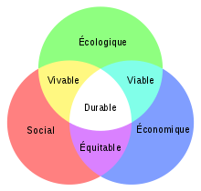

*Réponse publiée [sur Quora](https://fr.quora.com/Diriez-vous-que-le-d%C3%A9veloppement-peut-%C3%AAtre-durable/answer/Dr-Goulu)*

Pas sur. Le [Développement durable](w:) repose sur 3 piliers : écologique, économique et social, illustrés partout par ce joli dessin:

Mais qui dit que les 3 piliers ont réellement des intersections, surtout l'intersection "durable" commune ?

A mon humble avis il manque un facteur essentiel, que l'on retrouve dans l' [Équation de Kaya](w:) qui en a 4 : la population.

Mon impression pifométrique est que la population écarte les 3 piliers. Si j'étais seul au monde, les trois cercles se superposeraient parfaitement. Quand on est une tribu du néolithique, il y a un peu d'inégalités et on laisse de la suie dans les cavernes, mais ça reste vachement durable.

Je ne sais pas à quelle population ( multipliée par le PIB si vous voulez) le blanc disparaît, mais à 8 milliards il ne doit plus en rester beaucoup, s'il en reste.

[Développement Durable et Equation de Kaya - Pourquoi Comment Combien](/2009/06/06/developpement-durable-et-equation-de-kaya/)
