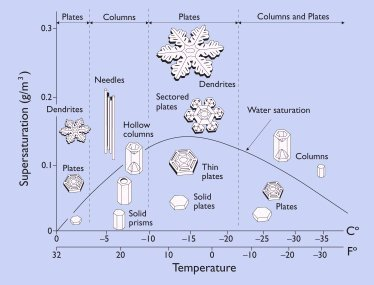

*Réponse publiée [sur Quora](https://fr.quora.com/Combien-y-a-t-il-de-flocons-de-neige-diff%C3%A9rents/answer/Dr-Goulu)*

La forme générale des flocons dépend des conditions de température et humidité lors de leur formation :

Si on observe les dendrites au microscope, il n'y en a probablement jamais deux rigoureusement identiques.

[Il neige de beaux flocons ! - Pourquoi Comment Combien](https://www.drgoulu.com/2007/01/23/il-neige-de-beaux-flocons/)
