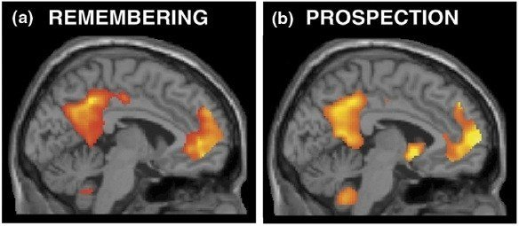

*Réponse publiée [sur Quora](https://fr.quora.com/Dun-point-de-vue-ath%C3%A9e-quest-ce-qui-fait-que-notre-conscience-soit-li%C3%A9e-%C3%A0-notre-cerveau-sp%C3%A9cifiquement/answer/Dr-Goulu)*

N'étant pas athée mais [ignostique](w:Ignosticisme), je me permets de répondre plutôt d'un point de vue évolutionniste.

Des travaux récents ont montré que notre cerveau nous permet de "voyager dans le temps" en utilisant les mêmes zones pour nous souvenir d'éléments passés que pour imaginer des situations futures :

Cette faculté, que les animaux n'ont pas, implique que le cerveau ait une "représentation de nous mêmes" qui puisse "voyager dans le temps". Ce n'est que parce que je sais que je serai à peu près le même demain qu'hier que je peux prévoir ce que je ferai demain en fonction de ce que j'ai vécu hier .

La [neurobiologie de la conscience](w:Conscience_(biologie)) montre que cette fonction est très complexe et fait intervenir de nombreuses zones du cerveau qu'après plusieurs années. Plusieurs expériences montrent que le bébé a peu de souvenirs (il oublie un jouet qui vient de disparaître) et aucune anticipation (il ne pleure pas 10 minutes avant d'avoir faim pour vous laisser préparer le biberon…)

La conscience est un avantage évolutif déterminant, probablement encore plus important que l'intelligence, car elle permet d'échafauder des plans à long terme, que ce soit pour accéder à la nourriture ou pour la reproduction. Pardon : l'Amour.

bref : la conscience n'est qu'un effet de bord de la capacité du cerveau à simuler ( = anticiper) la réalité. Mais c'est très chouette, j'aime bien !

références dans [Neurologie du Temps - Pourquoi Comment Combien](https://www.drgoulu.com/2009/06/27/neurologie-du-temps/)
