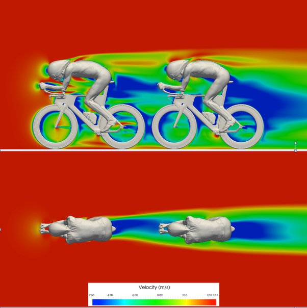
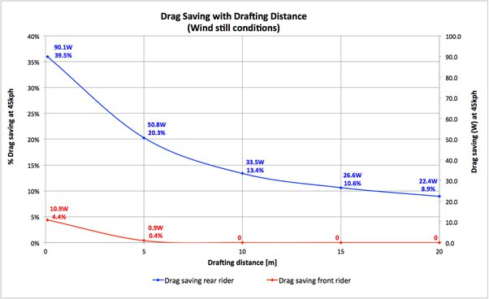

*Réponse publiée [sur Quora](https://fr.quora.com/Pouvez-vous-mexpliquer-le-principe-d%C3%AAtre-dans-la-roue-en-cyclisme-Est-ce-un-avantage-r%C3%A9el-ou-simplement-psychologique-Cela-peut-il-sappliquer-%C3%A0-une-balade-en-v%C3%A9lo-en-famille/answer/Dr-Goulu)*

L'aérodynamique est complètement modifiée, car l'air derrière le cycliste est entraîné dans son sillage, ce qui permet au cycliste suiveur d'économiser beaucoup d'énergie. Etonnamment ça en fait économiser aussi un peu au cycliste de tête.

(source et détails [Drafting - how far is close enough?](https://www.swissside.com/blogs/news/the-deal-with-drafting) )

Ce fait est à la base de toute la stratégie des équipes cyclistes.

Mais aussi en course automobile.

Et aussi au vol des oiseaux migrateurs.

pour une ballade familiale à petite vitesse, c'est moins critique…
