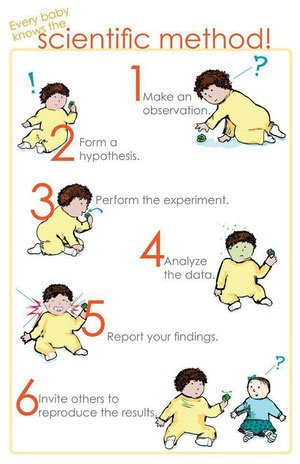

*Réponse publiée [sur Quora](https://fr.quora.com/Comment-proc%C3%A8de-t-on-pour-cr%C3%A9er-une-nouvelle-Th%C3%A9orie-physique-est-ce-un-fait-de-hasard-ou-cest-un-processus-d%C3%A9ductif-bien-d%C3%A9fini/answer/Dr-Goulu)*

La physique étant une science, on applique la [méthode scientifique](w:) :

Donc, très important , le point de départ : on part d'une **observation pas ou mal décrite par les théories existantes** (qu'on commence par apprendre en une vingtaine d'années d'études, évidemment).

Dans la liste actuelle de telles observations il y a l'anomalie de la [Courbe de rotation des galaxies](w:) et l' [Accélération de l'expansion de l'Univers](w:) par exemple. Notez que la matière noire et l'énergie sombre ne sont PAS des observations. Les observations, c'est expérimental. Là le "hasard" intervient parfois sous la forme de résultats inattendus qu'il faut avoir la chance ou la sagacité de repérer.

Ensuite on forme une **hypothèse**qui permet de décrire ce phénomène tout en n'étant pas (trop) contradictoire avec toutes les autres observations. Ce n'est pas encore une "[théorie](w:)", à ce stade c'est juste une [hypothèse](w:). A mon sens, c'est plus un processus [inductif](w:Induction_(logique)) que déductif car on doit généraliser toutes les observations en une formulation la plus synthétique possible. Dire qu'il existe une "[matière noire](w:)" faite de particules massives mais invisibles qui s'organise en anneaux autour des galaxies est une hypothèse. Parmi d'autres.

Ensuite on "valide" cette hypothèse par au moins une **expérience**qui permet de la distinguer des autres hypothèses. Par exemple, on recherche des [WIMP](w:Weakly_interacting_massive_particles) avec des détecteurs qui coûtent des millions. Et même si on n'en trouve pas pendant 10 ans, on continue jusqu'à ce qu'on en trouve, ou jusqu'à ce qu'une autre expérience valide une autre hypothèse. C'est long, mais c'est comme ça : pas de Prix Nobel avant validation expérimentale.

C'est même encore plus long que ça, parce qu'il faut publier l'hypothèse, mais surtout les résultats de l'expérience pour encourager d'autres chercheurs à effectuer d'autres expériences qui confirment la validation. Et aussi qui vérifient que l'hypothèse est compatible avec les autres faits expérimentaux. Exemple au hasard : une théorie de la gravitation quantique qui décrirait pourquoi la censure cosmique cache la singularité des trous noirs de Kerr doit aussi décrire comment un caillou tombe par terre…

Ce n'est qu'après tout ça que votre hypothèse pourra devenir une vraie [théorie](w:) :

> ensemble [cohérent](w:Cohérence) d'explications, de notions ou d'idées sur un sujet précis, pouvant inclure des [lois](w:Loi) et des [hypothèses](w:Hypothèse), induites par l'accumulation de faits provenant de l'[observation](w:) et de l'[expérimentation](w:Expérience) .
