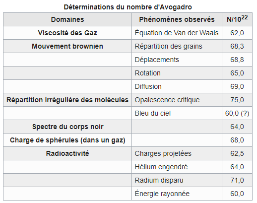

*Réponse publiée [sur Quora](https://fr.quora.com/Quand-a-t-on-%C3%A9valu%C3%A9-pour-la-premi%C3%A8re-fois-le-nombre-dAvogadro/answer/Dr-Goulu)*

[Johann Josef Loschmidt — Wikipédia](w:Johann_Josef_Loschmidt) ;

> En 1811, [Amedeo Avogadro](w:) avait émis l'idée selon laquelle le volume d'une certaine quantité d'un gaz devait être proportionnel au nombre de molécules contenues dans ce volume.
>
>
>
> En **1865**, dans la seconde partie de son ouvrage *Etudes chimiques*, [Johann Josef Loschmidt](w:) calcule la première approximation du nombre de molécules d'air par unité de volume. Il estime qu'il y a 1,81 x 10^24 molécules par [m3](w:Mètre_cube) d'air.
>
>
>
> Ce nombre est ré-estimé à 1,9 x 10^25 par Maxwell qui l'appelle C*onstante de Loschmidt*

puis [Jean Perrin — Wikipédia](w:Jean_Perrin):

> Après qu'[Albert Einstein](w:) eut publié (1905) son explication théorique du [mouvement brownien](w:) en fonction du [mouvement](w:Mouvement_(mécanique)) [aléatoire](w:Variable_aléatoire_réelle) des [molécules](w:Molécule), Jean Perrin effectua les expériences pour vérifier les prédictions d'Einstein. Il démontre en 1908 un accord complet entre théorie et expérience, ce qui confirme l'existence effective des atomes, proposée un siècle auparavant par [John Dalton](w:).
>
>
>
> Dans son livre *Les Atomes*, il détermine par plusieurs méthodes la valeur du [nombre d'Avogadro](w:). Il résume ses déterminations par le tableau suivant:
>
>
>
> 
>
>
>
> Il conclut: « **On est saisi d'admiration devant le miracle de concordances aussi précises à partir de phénomènes si différents. D'abord qu'on retrouve la même grandeur, pour chacune des méthodes, en variant autant que possible les conditions de son application, puis que les nombres ainsi définis sans ambiguïté par tant de méthodes coïncident, cela donne à la réalité moléculaire une vraisemblance bien voisine de la certitude.** »

Je copie "vraisemblance bien voisine de la certitude." pour la recoller dans plein de réponses à des questions du type "quelle est la preuve scientifique…"
