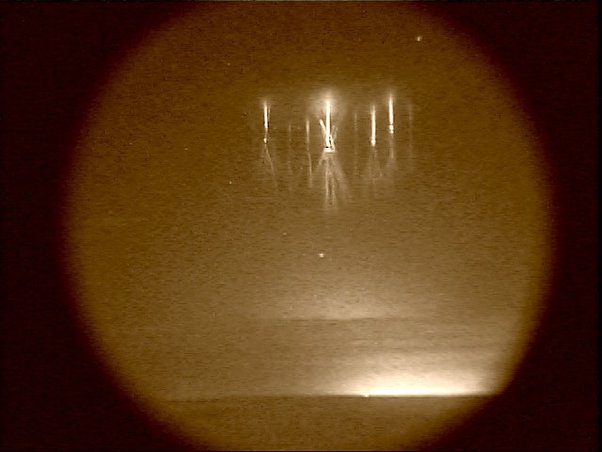

*Réponse publiée [sur Quora](https://fr.quora.com/Avez-vous-une-id%C3%A9e-sur-ce-que-pouvait-%C3%AAtre-les-lumi%C3%A8res-de-phoenix-en-Mars-1997-lexplication-des-fus%C3%A9es-%C3%A9clairantes-ne-semble-pas-tenir-la-route/answer/Dr-Goulu)*

Les OVNI sont des Objets Volants Non Identifiés ?

Alors les [Lumières de Phoenix](w:) répondent parfaitement à la moitié* de la définition : Non Identifiés.

Ca ne veut pas dire extraterrestres, inexplicables ou même non identifiables, ça veut juste dire que sur la base des données recueillies, on ne sait pas ce que c'était.

*Pour "Objet" et "Volant", c'est moins sur, ou ça dépend de la définition de ces termes. Un [farfadet](w:Phénomène_lumineux_transitoire) n'est pas vraiment un Objet, et il ne Vole pas vraiment…

Je ne dis pas que les lumières de Phoenix étaient un farfadet, je dis juste que les farfadets sont des LCRI . (Lumières dans le Ciel Rarement Identifiées)
