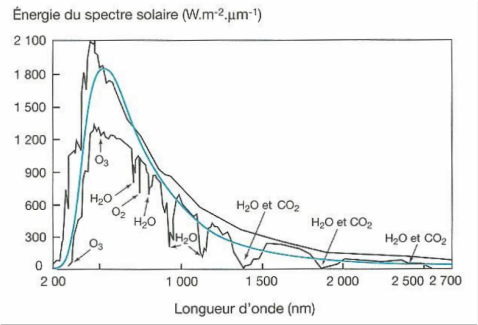

*Réponse publiée [sur Quora](https://fr.quora.com/Que-se-passerait-il-si-le-soleil-avait-une-couleur-différente/answer/Dr-Goulu)*

Mouais … le spectre solaire est effectivement un peu modifié par l'ozone (O3) dans l'UV et le visible, puis H2O et CO2 dans le rouge et l'infrarouge.

source : [Distribution de l'énergie solaire dans l'atmosphère et à la surface de la terre](http://www.e-educmaster.com/data_AFADEC/2d_degre/SVT_co_geo_Kuntzmann_2012-2_op/co/01module_Energie_solaire_6.html)

je ne vois pas l'azote, et le méthane serait aussi dans l'IR, bref il semble qu'il n'y ait pas de gaz courants qui atténueraient dans le visible …

Peut être une atmosphère d'halogènes …
