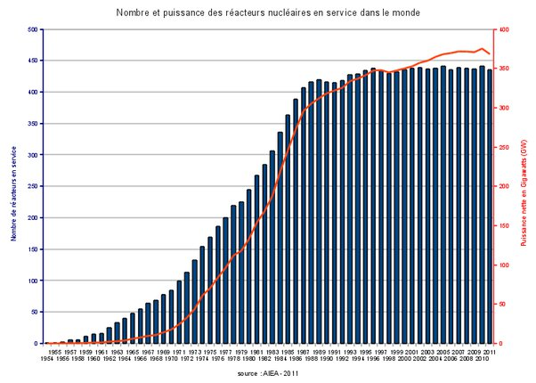
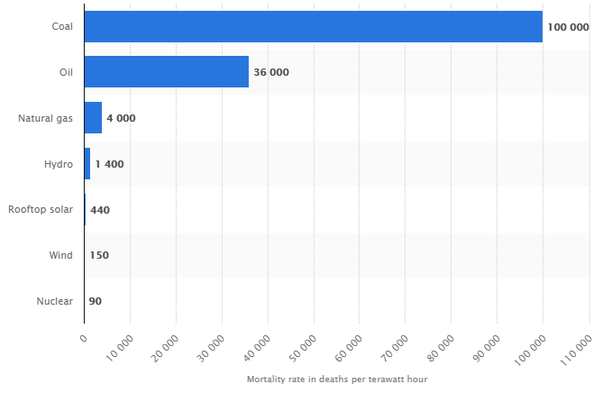

*Réponse publiée [sur Quora](https://fr.quora.com/Si-les-centrales-nucl%C3%A9aires-sont-si-s%C3%BBres-pourquoi-plusieurs-dentre-elles-ont-elles-connu-des-d%C3%A9faillances-aussi-catastrophiques/answer/Dr-Goulu)*

les normes en vigueur dans les pays industrialisés sont que les centrales nucléaires (ou les grands barrages qui contiennent autant d'énergie potentielle…) doivent résister à des événements qui ne se produisent qu'une fois tous les 10'000 ans en moyenne. On considère donc comme acceptable un risque de catastrophe de 1% par siècle, par réacteur.

Il y a actuellement environ 420 [réacteurs nucléaires en activité dans le monde](w:Liste_de_réacteurs_nucléaires) qui totalisent (pifométriquement d'après la figure ci-dessous) environ 250 x 40 ans d'activité cumulée, soit … 10'000 ans !

On a eu :

- un accident extrêmement grave (= qui a causé des milliers de morts) dans des circonstances plus proche d'un sabotage que d'une défaillance,
- un accident qui a contaminé une région suite à un tsunami dont la probabilité avait été jugée faible (conforme au 1/10'000 ?)
- d'autres [accidents nucléaires](w:Liste_d'accidents_nucléaires)qui n'ont pas eu d'incidence en dehors de la centrale.

On est donc peut-être légèrement au dessus du risque défini comme acceptable, peut-être parce que c'était le début de l'industrie, peut-être par malchance, mais pas vraiment nettement au dessus. ( voir [Ruptures de barrages](w:Rupture_de_barrage) pour comparer, puisqu'on utilise des normes proches…)

Donc : attendons encore 10'000 ans. Je veux dire 24 ans pour que les 420 centrales totalisent 10'000 ans de fonctionnement de plus et qu'on puisse refaire des stats. Et les comparer à la mortalité par TWh produit par les autres sources d'énergie, puisque finalement c'est ça qui devrait compter:

source : [Mortality rate globally by energy source 2018 | Statista](https://www.statista.com/statistics/494425/death-rate-worldwide-by-energy-source/)

ce graphique montre un aspect intéressant de la notion de "catastrophe" : un événement qui tue une centaine de personnes nous marque beaucoup plus que cent accidents qui n'en tuent qu'une …
