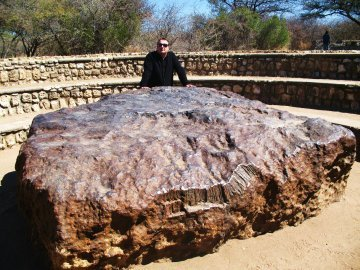

*Réponse publiée [sur Quora](https://fr.quora.com/Comment-conna%C3%AEt-on-une-m%C3%A9t%C3%A9orite/answer/Dr-Goulu)*

> Une [Météorite](w:) est un objet solide d'origine extraterrestre qui en [traversant l'atmosphère](w:Rentrée_atmosphérique) [terrestre](w:Terre) n'a pas [perdu toute sa masse](w:Ablation_(astronautique)), et qui en a atteint la surface solide sans y être entièrement [volatilisé](w:Vaporisation) lors de l'[impact](w:Impact_cosmique) avec cette surface. (Wikipédia)

Donc c'est un caillou un peu spécial, qu'on repère souvent parce qu'il est plus noir et de forme différente que les autres.

Ensuite ce sont des analyses de laboratoire qui peuvent montrer que le caillou ne vient pas de la Terre.

La plus grande météorite retrouvée sur Terre, à Hoba en [Namibie](https://www.drgoulu.com/2010/08/27/namibie/)
