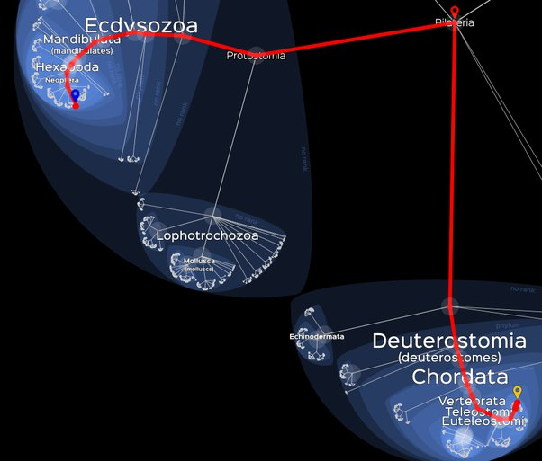

*Réponse publiée [sur Quora](https://fr.quora.com/Quelle-est-lentit%C3%A9-ou-la-cr%C3%A9ature-que-vous-connaissez-qui-na-pas-subi-la-loi-de-l%C3%A9volution/answer/Dr-Goulu)*

Aucune créature ne subit la loi de l'évolution. Vous n'évoluez pas, votre chien n'évolue pas, la puce sur son dos n'évolue pas.

Ce sont les **espèces**qui évoluent. [Ctenocephalides canis](w:) évolue pour résister aux insecticides que vous mettez sur votre [Canis lupus familiaris](w:Chien), qui évolue (surtout par sélection artificielle) pour être si mignon aux yeux des [Homo sapiens](w:), qui évoluent pour s'adapter à leur environnement de plus en plus étendu, par exemple [à la haute l'altitude.](https://www.drgoulu.com/2014/08/17/ladaptation-a-laltitude/)

Donc les individus, vous, votre chien, sa puce sont en effet le résultat de l'évolution, mais ils ne l'ont pas "subie", ils existent grâce à elle !

Sans évolution, il n'y aurait pas de raison que des Bilateria aient évolué d'une part en [Protostomia](w:) puis en plein de choses dont les puces, et d'autre part en [Deuterostomia](w:) qui ont évolué en plein de choses dont les chiens :

( [Lifemap](http://lifemap.univ-lyon1.fr/explore.html) )

En fait il n'y aurait même pas de raison pour que Bilateria ait existé, pas de raison qu'il existe autre chose que de l'[ARN se répliquant par autocatalyse](w:Ribozyme), pas de vie proprement dite.

L'évolution, c'est la vie !
