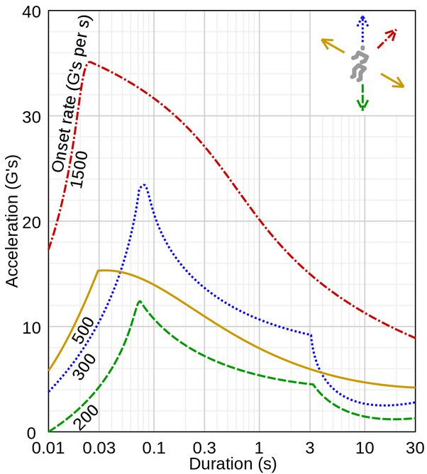

*Réponse publiée [sur Quora](https://fr.quora.com/Peut-on-envoyer-un-astronaute-dans-lespace-par-catapulte-depuis-la-surface-lunaire/answer/Dr-Goulu)*

Chouette, un p'tit calcul.

La [Vitesse de libération](w:) de la Lune est de 2400 m/s (8640 km/h …) et l'[être humain supporte les accélérations](w:G_(accélération))pendant un certain temps selon le graphique suivant :

Pour atteindre 2400 m/s sans tuer l'astronaute, la première possibilité est de l'accélérer pendant 30 secondes à 80 m/s^2, environ 8g.

La longueur nécessaire à cette accélération est d=a.t^2/2 soit 36 kilomètres …

Ca fait une sacré catapulte, et ça explique pourquoi on préfère des fusées qui poussent moins fort pendant plus longtemps …
