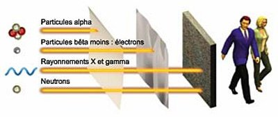

*Réponse publiée [sur Quora](https://fr.quora.com/Quel-type-de-d%C3%A9sint%C3%A9gration-radioactive-alpha-b%C3%AAta-ou-gamma-est-le-plus-dangereux/answer/Dr-Goulu)*

La réponse se trouve dans la définition du [Sievert](w:), qui utilise des facteurs de pondération de l'énergie du rayonnement:

- 1 pour les [rayons X](http://www.wikipedia.org/search-redirect.php?language=fr&go=Go&search=rayons+X), [gamma](http://www.wikipedia.org/search-redirect.php?language=fr&go=Go&search=Rayon_gamma) et [bêta](http://www.wikipedia.org/search-redirect.php?language=fr&go=Go&search=Particule_bêta)
- 2 pour les protons
- entre 2 et 20 [selon l’énergie](https://www.drgoulu.com/wp-content/uploads/2013/11/facteu11.jpg) pour les [neutrons](http://www.wikipedia.org/search-redirect.php?language=fr&go=Go&search=Neutron#Radioactivité)
- 20 pour le reste, essentiellement les [particules alpha](http://www.wikipedia.org/search-redirect.php?language=fr&go=Go&search=Particule_alpha)

Ca peut surprendre si on se rappelle qu’une particule alpha (qui est un noyau d’hélium) est stoppée par une bête feuille de papier, que les bêta s’arrêtent contre une feuille métallique (parce que ce sont des électrons ou des [positrons](http://www.wikipedia.org/search-redirect.php?language=fr&go=Go&search=Positron), chargés électriquement) alors que les X et les gamma traversent tout sauf une épaisse couche de blindage.

Justement : nous ne sommes pas une épaisse couche de blindage, ni métalliques : les X et gamma nous traversent facilement, en interagissant peu.

Par contre les alpha, on se les prend en plein dans la viande, et leur énergie peut faire des dégâts à notre ADN en particulier, avec risques de cancers supplémentaires à la clé.

Donc paradoxalement, les rayons les plus néfastes sont ceux contre lesquels il est le plus facile de se protéger : les alpha.

Et ça explique aussi pourquoi une protection qui peut paraître dérisoire comme une combinaison ou des plaques de tôle sont déjà pas mal efficaces contre la radioactivité, au moins alpha et bêta.
