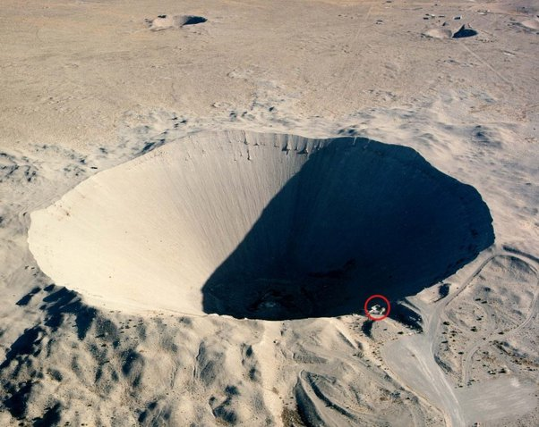
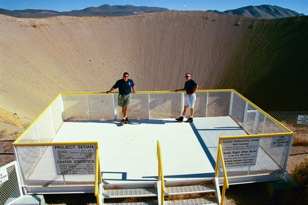

*Réponse publiée [sur Quora](https://fr.quora.com/Une-bombe-nucl%C3%A9aire-fait-un-trou-de-quelle-profondeur/answer/Dr-Goulu)*

En principe elle ne fait pas de cratère parce qu'on la fait exploser en altitude pour différentes raisons:

1. l'explosion touche une plus grande surface
2. elle détruit les systèmes électroniques par effet EMP
3. elle fait moins de retombée radioactives (justement parce qu'elle aspire moins de matière du sol, qui devient radioactive dans le champignon)
4. elle ne risque pas d'être détruite lors du contact avec le sol au point de ne pas exploser. C'est la raison pour laquelle Hiroshima et Nagasaki ont pété à environ 500m d'altitude …

Ceci dit, on peut quand même les faire détonner au sol, ou même en dessous du sol pour détruire des bunkers par exemple. D'ailleurs [Le plus grand cratère d’origine humaine](https://www.laboiteverte.fr/le-plus-grand-cratere-dorigine-humaine/) a été fait par une bombe nucléaire enterrée à 200m de profondeur pour un essai. D'une puissance de 104 kT, la bombe a déplacé plus de 11 000 000 tonnes de terre. et fait un cratère de plus de 400m de diamètre et de 100m de profond, le cratère de [Sedan :](w:Sedan_(essai_nucléaire))

et dans le rond rouge il y a:

L'essai est réussi dans la mesure où il était justement destiné à évaluer les applications "civiles" une explosion nucléaire pour percer un canal de Panama bis par exemple …
