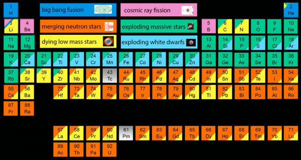

*Réponse publiée [sur Quora](https://fr.quora.com/Si-toutes-les-planètes-sont-issues-du-Big-Bang-pourquoi-la-matière-de-lunivers-na-t-elle-pas-le-même-âge/answer/Kevin-Loussert)*

Il existe un tableau périodique qui montre l'origine des éléments :

[Ce tableau périodique révèle les origines de chaque atome présent dans notre corps](https://trustmyscience.com/tableau-periodique-revele-les-origines-de-chaque-atome-present-dans-notre-corps/)
