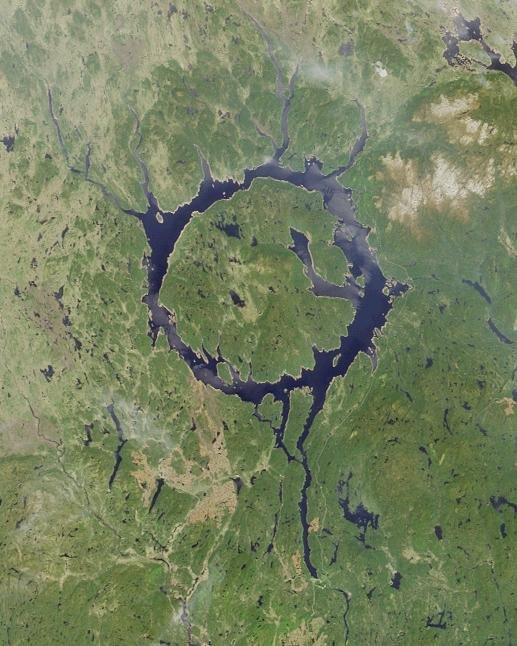

*Réponse publiée [sur Quora](https://fr.quora.com/Quelles-sont-quelques-images-étonnantes-de-barrages/answer/Hartz-Jakintsua)*

Et le lac ! Tu as oublié de parler du lac ! Le voilà vu du ciel (le barrage est en bas de la large rivière) :

C'est un des plus grand cratères d'impact du monde !

[de Manicouagan à Rochechouart - Pourquoi Comment Combien](https://www.drgoulu.com/2009/04/16/de-manicouagan-a-rochechouart/)
