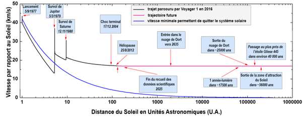

*Réponse publiée [sur Quora](https://fr.quora.com/Comment-expliquer-quun-objet-utilise-une-planète-pour-augmenter-sa-vitesse-L-accélération-lors-de-son-approche-nest-elle-compensée-par-une-freinage-équivalent-lors-de-son-éloignement/answer/Dr-Goulu)*

J'aime beaucoup le graphique ci-dessous (plus grand dans [Voyager 1 — Wikipédia](w:Voyager_1) ) où on voit que l'assistance gravitationnelle produit des pics de vitesse très vite amortis dans le puits gravitationnel de Jupiter + Saturne, mais que la composante radiale dans le puits gravitationnel du Soleil augmente assez pour en sortir.

