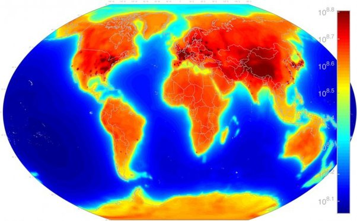

*Réponse publiée [sur Quora](https://fr.quora.com/Quels-pays-sont-les-moins-touch%C3%A9s-par-la-radioactivit%C3%A9/answer/Dr-Goulu)*

Depuis 2015 on peut mesurer les désintégrations radioactives sur toute la Terre grâce aux [Observatoire de (anti) neutrinos](w:Observatoire_de_neutrinos)[[1]](#iIFdV), même si ces désintégrations ont lieu dans une cuve d'acier dans une enceinte en béton, le tout dans une montagne…

Cette carte[[2]](#Mjgxz) montre le nombre d'antineutrinos qui passe à travers chaque cm2 de la surface terrestre à chaque seconde. Il y en a près d'un milliard (échelle de droite), plus précisément entre 400 millions (orange clair) et 630 millions (rouge foncé) sur les continents.

On voit clairement les réacteurs nucléaires (points bien distincts en Amérique Latine et USA notamment), mais aussi les chaînes montagneuses riches en Uranium et Thorium (Himalaya, Alpes…).

En France, il y a les deux ;-) Mais notez bien que ce n'est pas la radioactivité à laquelle vous êtes exposé, qui se mesure en Sievert, et pour laquelle je n'ai pas trouvé de carte.

L'Australie, c'est pas mal …

Notes de bas de page

[[1]](#cite-iIFdV)[Grâce aux antineutrinos, voici la 1ère carte mondiale de l'activité nucléaire](https://www.sciencesetavenir.fr/fondamental/particules/grace-aux-antineutrinos-voici-la-1ere-carte-mondiale-de-l-activite-nucleaire_104273)

[[2]](#cite-Mjgxz)[AGM2015: Antineutrino Global Map 2015](https://www.nature.com/articles/srep13945)
