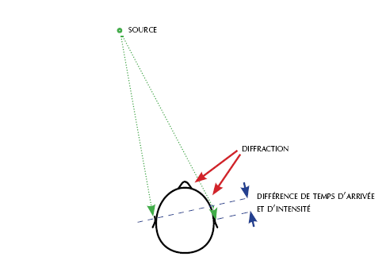

*Réponse publiée [sur Quora](https://fr.quora.com/Comment-localisons-nous-la-provenance-dun-son/answer/Dr-Goulu)*

Par le déphasage (décalage temporel des ondes sonores) entre nos deux oreilles.

La forme du visage et les pavillons des oreilles permettent de distinguer avant/arrière en déformant le son différemment. Essayez en écoutant de la musique avec des écouteurs: vous percevez clairement le gauche/droite, mais pas l'avant/arrière. Dans certains jeux video, le son est recréé différemment selon l'orientation de votre personnage dans le jeu pour que vous perceviez l'avant/arrière.

En passant :

1. dans l'eau on arrive pas à localiser un son parce que la vitesse du son est plus élevée que dans l'air, et la différence temporelle est si faible qu'on localise le son à l'intérieur de notre tête ..
2. Certains aveugles arrivent à faire de l'écholocation comme les chauves souris ! Ils captent des échos avec une précision de l'ordre de la milliseconde, soit 2x 15cm de précision spatiale ! [Comment voir avec ses oreilles - Pourquoi Comment Combien](/2016/05/18/comment-voir-avec-ses-oreilles/)
