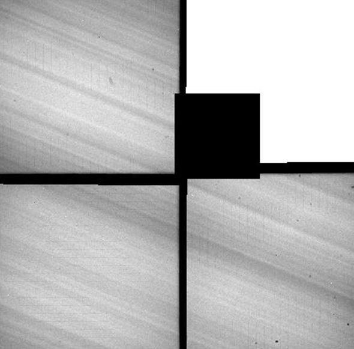

*Réponse publiée [sur Quora](https://fr.quora.com/Si-le-t%C3%A9lescope-Hubble-%C3%A9tait-tourn%C3%A9-vers-la-terre-quel-est-le-plus-petit-d%C3%A9tail-quon-verrait/answer/Dr-Goulu)*

Hubble est régulièrement braqué vers la Terre pour calibrer ses caméras, mais elle défile si vite que les images sont totalement floues.

La [résolution](w:Pouvoir_de_résolution)de Hubble est de 0.1[seconde d’arc](w:Seconde_d'arc), ce qui correspond à 30 centimètres sur la Terre, et 200 mètres sur la Lune.

[10 choses que vous ignorez à propos de Hubble - Pourquoi Comment Combien](/2009/05/13/10-choses-que-vous-ignorez-a-propos-de-hubble/)

Edit : j'ai retrouvé des images de la Terre prises par Hubble. Pas terrible:

