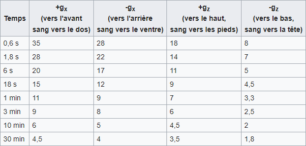
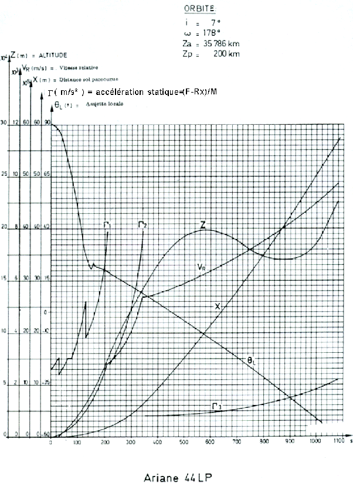

*Réponse publiée [sur Quora](https://fr.quora.com/Quelle-est-la-force-g-exerc%C3%A9e-lors-dun-lancement-de-fus%C3%A9e-Combien-de-force-g-peut-%C3%AAtre-exerc%C3%A9e-sur-le-corps-humain-avant-quil-natteigne-linconscience/answer/Dr-Goulu)*

La [toléance humaine à l'accélération](w:G_(accélération)) dépend de la direction de celle-ci, mais aussi de sa durée. Le tableau de [Tolérance du corps humain selon la NASA](w:G_(accélération))est le suivant :

Sur [PREMIER COURS SUR LE LANCEUR : Généralités](http://mecaspa.cannes-aero-patrimoine.net/COURS_LA/COURS01/LANCEUR1.htm) j'ai trouvé ce graphique montrant l'accélération d'une [Ariane 4](w:) . L'accélération statique (il faut lui ajouter le g du à la gravité terrestre) est donnée par les courbes

- $\Gamma_1$ jusqu'au largage des propulseurs d'appoint à poudre (PAP)
- $\Gamma_2$ jusqu'au largage des propulseurs d'appoint liquide (PAL)
- $\Gamma_3$ jusqu'au largage du premier étage

On voit que l'accélération max atteint 40 m/s au largage des boosters, soit 5g avec la gravité , mais que ça dure 5 minutes au maximum, donc un homme couché sur le dos supporterait ça "facilement".

