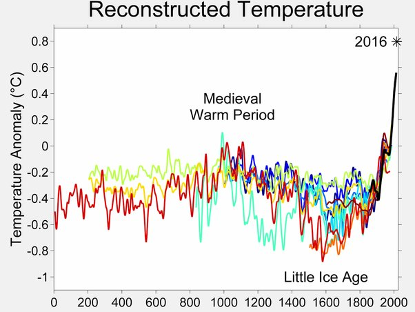
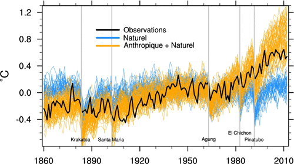

*Réponse publiée [sur Quora](https://fr.quora.com/Pourquoi-alors-que-la-communauté-scientifique-n-est-pas-sûre-du-lien-entre-les-activités-humaines-et-le-réchauffement-de-la-planète-les-politiciens-tiennent-pour-acquis-l-existence-d-un-lien/answer/Dr-Goulu)*

On connait assez bien les phénomènes naturels passés, notamment les éruptions volcanique. Il y en a eu moins que la moyenne pendant l'Optimium Médieval et plus que d'habitude pendant le Petit Age Glaciaire . Il semblerait d'autre part que ces variations étaient plus assez localisées dans l'hémisphère Nord plutôt que globales.

A part ça et une fois de plus, la situation actuelle n'a rien à voir

Sur ce graphique que l'on trouve sur le site de Meteo France ([Le climat futur à l'échelle du globe](http://www.meteofrance.fr/climat-passe-et-futur/le-climat-futur-a-l-echelle-du-globe) ) on retrouve

1. l'effet des volcans
2. le même effet que les courbes "de communication" : si on intègre pas l'activité humaine aux simulations, on ne retrouve pas nos petits.

