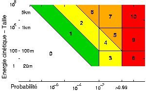

*Réponse publiée [sur Quora](https://fr.quora.com/Que-se-passerait-il-si-un-ast%C3%A9ro%C3%AFde-g%C3%A9ant-se-dirigeait-vers-la-Terre/answer/Dr-Goulu)*

Géant comment?

[Échelle de Turin — Wikipédia](w:Échelle_de_Turin):

- **Niveau 8** : collision certaine capable de provoquer une destruction localisée. Un tel événement se produit tous les 50 à 1 000 ans en moyenne.
- **Niveau 9** : collision certaine avec destruction d'une région. Un tel événement se produit tous les 1 000 à 100 000 ans en moyenne.
- **Niveau 10** : collision certaine entraînant une catastrophe climatique globale pouvant menacer l'avenir de l'humanité. Un tel événement se produit moins d'une fois tous les 100 000 ans en moyenne.
