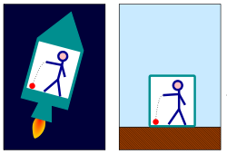

*Réponse publiée [sur Quora](https://fr.quora.com/Comment-expliquer-la-th%C3%A9orie-de-la-relativit%C3%A9-g%C3%A9n%C3%A9rale-%C3%A0-sa-grand-m%C3%A8re/answer/Dr-Goulu)*

On va essayer.

La première étape est la plus difficile : il faut accepter les deux [postulats d'Einstein de la relativité restreinte](w:Relativité_restreinte):

1. **Les lois de la physique sont les mêmes dans tous les**[**référentiels galiléens**](w:Référentiel_galiléen)**.** (pour les non galiléens, voire plus bas…)
Ca semble assez évident : la physique est la même qu'on soit dans un train ou sur un quai .
2. **La**[**vitesse de la lumière**](w:Vitesse_de_la_lumière)**dans le vide a la même valeur dans tous les référentiels galiléens.**
Ca c'est pas évident du tout, mais c'est une réalité expérimentale depuis la fameuse [Expérience de Michelson et Morley](w:) qui a lancé toute la réflexion d'Albert.

Une fois que vous avez accepté ces deux postulats, tout le reste s'ensuit logiquement, notamment que :

1. on ne peut pas additionner des vitesses avec le signe + .
2. les distances dépendent de l'observateur.
3. Cerise sur le gâteau : le temps dépend de l'observateur aussi.

Ceci est très bien expliqué dans cette vidéo sans aucune formule :

[https://www.youtube.com/watch?ti...](https://www.youtube.com/watch?time_continue=116&v=JTaMfufMl1o)

**Si ça vous choque, c'est trop tard : vous avez accepté les postulats.**

Et si vous avez mal à la tête, c'est que vous ne les avez pas vraiment acceptés.

———————————-

Maintenant, **pour les référentiels non galiléens, il y a la**[**Relativité générale**](w:Relativité_générale), qui demande d'admettre le [Principe d'équivalence](w:) en plus des postulats.

Ce principe dit que la physique est la même si on est sur le sol d'un planète dotée d'une gravité de x m/s^2 (x=9.81 sur Terre) ou si on est dans une fusée accélérée à x m/s^2.

Si vous acceptez ce principe, alors :

- même en accélérant indéfiniment la fusée à x m/s^2 , un observateur extérieur ne la verra jamais passer à une vitesse supérieure ou égale à c
- les rayons lumineux ne vont plus tout droit
- mais en fait ils vont tout droit dans un espace déformé par les masses
- le temps se contracte à proximité des grosses masses
- en fait le temps et l'espace sont liés et se déforment simultanément
- l'espace-temps s'enroule autour de grosses masses en rotation
- si elles ne tournent pas rond, elles génèrent des ondes gravitationnelles
- etc. etc.

Malheureusement je ne connais pas de petite vidéo expliquant tout ça aussi clairement que celle sur la relativité restreinte, mais c'est la même démarche.

Albert a déduit tout ça théoriquement juste de ses postulats et du principe d'équivalence, et tout s'est vérifié expérimentalement avec une grande précision.

Ca a encore marché : penser à ce coup de génie pur m'a fait oublier mes douleurs de quinqua…

[Comment expliquer la relativité aux enfants - Pourquoi Comment Combien](/2013/12/15/comment-expliquer-la-relativite-aux-enfants/)
