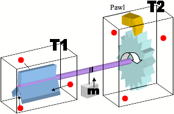

*Réponse publiée [sur Quora](https://fr.quora.com/Pourquoi-l%C3%A9nergie-ne-peut-elle-pas-%C3%AAtre-produite-%C3%A0-partir-de-chaleur-puisque-l%C3%A9nergie-est-de-la-chaleur/answer/Dr-Goulu)*

La chaleur par rapport à quoi ?

La chaleur correspond à un déplacement de particules, pour pouvoir l'exploiter il faut que le dispositif soit plus froid.

Exemple célèbre : la [roue à cliquet de Feynman-Smoluchowski](http://www.wikipedia.org/search-redirect.php?language=en&go=Go&search=Brownian_ratchet)

, un nano-moteur mu par le mouvement brownien:

Là, c’est une bonne maîtrise du [deuxième principe de la thermodynamique](http://www.wikipedia.org/search-redirect.php?language=fr&go=Go&search=deuxième+principe+de+la+thermodynamique) qui est nécessaire pour montrer que ces systèmes peuvent fonctionner, mais nécessitent qu’on leur apporte de l’énergie de l’extérieur conformément aux lois susmentionnées. Dans le cas de la roue à cliquet, c’est d’ailleurs Feynman lui-même qui a montré que ce moteur ne fonctionne que si la température T1 est plus élevée que T2, et que la puissance du moteur ne dépasse pas celle prévue par l'[efficacité de Carnot](http://www.wikipedia.org/search-redirect.php?language=fr&go=Go&search=Cycle+de+Carnot#L&#8217;efficacité+de+Carnot)

.

[Dites NON au mouvement perpétuel - Pourquoi Comment Combien](https://www.drgoulu.com/2012/05/27/dites-non-au-mouvement-perpetuel/)
