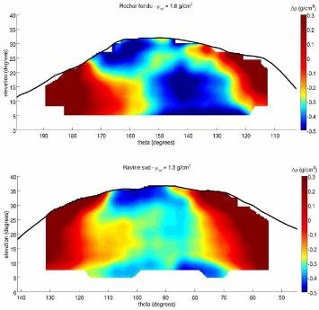

*Réponse publiée [sur Quora](https://fr.quora.com/Comment-sauriez-vous-si-le-volcan-va-exploser/answer/Dr-Goulu)*

Les volcanologues ont désormais des outils de mesure très sophistiqués. Ils peuvent mesurer le gonflement du volcan sous la pression interne par gps ou directement par satellite .

encore plus fort, on peut désormais radiographier un volcan en temps réel :

[Comment radiographier un volcan - Pourquoi Comment Combien](/2013/12/07/comment-radiographier-un-volcan/)

Malgré ça on ne peut pas prévoir une éruption avec précision, juste évaluer la probabilité qu'elle se produise.
