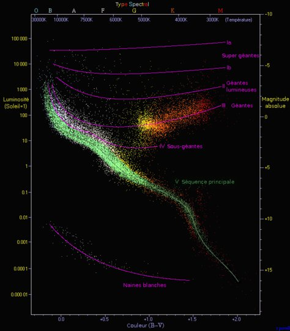
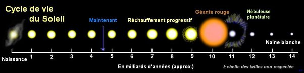

*Réponse publiée [sur Quora](https://fr.quora.com/Comment-sait-on-que-la-dur%C3%A9e-de-vie-du-soleil-est-de-15-milliards-dann%C3%A9es/answer/Dr-Goulu)*

La connaissance de l'[Évolution stellaire](w:) est le résultat combiné de deux approches:

1. les statistiques faites sur un très grand nombre d'étoiles qui montrent qu'elles se répartissent en groupes bien visibles dans le [Diagramme de Hertzsprung-Russell](w:):

2. La connaissance des [chaînes de fusion nucléaire en astrophysique](w:Fusion_nucléaire), qui a permis de comprendre l'évolution d'une étoile dans ce graphique, et combien de temps elle passe dans chaque étape.

Quelle que soit l'étoile, elle va passer la plupart de son temps à fusionner de l'Hydrogène en Hélium dans la "[Séquence principale](w:)", et ce temps est calculable à partie de la masse (réserve d'hydrogène) et de la luminosité (puissance rayonnée)

Par exemple pour le [Soleil](w:), on peut calculer qu'il va passer 9 milliards d'années sur la séquence principale, puis suivre le tracé dans le diagramme ci-dessous:

L [évolution du Soleil](w:Soleil) sera donc la suivante, sans l'ombre d'un doute, sauf que le point blanc à droite sera si brillant qu'il devrait vous aveugler instantanément si on arrivait à le reproduire sur l'écran, plus de 1000x plus lumineux que le Soleil !

Dire que cette histoire dure 15 milliards d'années me semble un peu discutable car une [Naine blanche](w:) est pratiquement éternelle tellement elle se refroidit lentement. Il me semble plus juste de dire environ 11, lorsque la fusion de l'Helium s'arrêtera. Après ça le Soleil ne sera plus vraiment une étoile, plutôt une braise.

Mesurer l'âge actuel du Soleil est un peu plus compliqué, mais comme je vois que ça fait l'objet d'une autre question, ça fera l'objet d'une réponse séparée.
