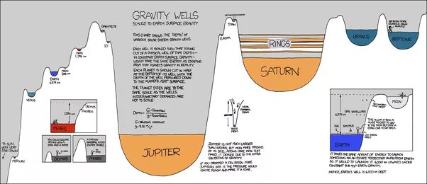
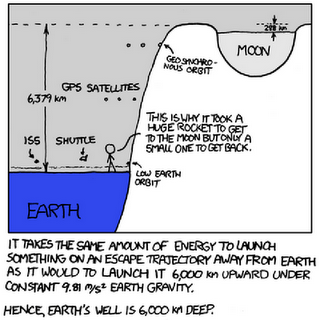

*Réponse publiée [sur Quora](https://fr.quora.com/Jusqu-o%C3%B9-s-%C3%A9tend-la-zone-gravitationnelle-d-un-astres-et-pourquoi-s-arr%C3%AAte-t-elle-pass%C3%A9-une-certaine-distance-du-noyau-de-ces-derniers/answer/Dr-Goulu)*

La portée de la gravitation est infinie.

Simplement, la gravitation est une [Loi en carré inverse](w:), donc elle décroît vite avec la distance.

En "intégrant" la force de gravitation jusqu'à l'infini et en divisant le résultat par l'attraction gravitationnelle de la Terre on arrive à l'intéressante notion de [Puits gravitationnel](w:) : on peut représenter l'attraction de n'importe quel astre comme étant un "trou" d'une certaine profondeur. Pour le système solaire, ça donne ce [génial dessin "Gravity Wells" de XKCD](https://xkcd.com/681/) :

Pour la Terre, le trou est de 6379 km : pour s'échapper de l'attraction terrestre (en théorie jusqu'à une distance infinie), il faut dépenser autant d'énergie que pour monter de 6379 km si la gravité était constante

[Un petit pas pour l'homme ... dans un petit puits gravitationnel. - Pourquoi Comment Combien](/2012/09/05/un-petit-pas-pour-lhomme/)
