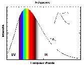

*Réponse publiée [sur Quora](https://fr.quora.com/En-physique-plus-une-chose-est-chaude-plus-elle-est-de-couleur-bleue-pourquoi-le-Soleil-n-est-pas-de-cette-couleur/answer/Dr-Goulu)*

Une réponse serait de dire qu'il n'est pas assez chaud. Sa surface est à 5500°C environ alors que Sirius est à 9700°C et d'autres étoiles sont encore plus chaudes et bleues.

L'autre réponse est de dire que notre perception des couleurs est alignée par l'évolution au spectre de notre étoile. Comme nous appelons "jaune" le rayonnement correspondant au maximum de son spectre et qui est au milieu approximatf de notre perception visuelle, nous appelons "bleu" la lumière de plus haute fréquence.

Un habitant d'une planète de Sirius trouverait probablement aussi son étoile "jaune" et la notre "rouge" dans son vocabulaire.
