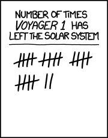

*Réponse publiée [sur Quora](https://fr.quora.com/Notre-syst%C3%A8me-solaire-est-il-d%C3%A9limit%C3%A9-par-une-fronti%C3%A8re-comme-semble-lindiquer-la-sonde-voyager-2/answer/Dr-Goulu)*

[Brice Haziza](https://fr.quora.com/profile/Brice-Haziza) a mentionné deux "frontières", mais si on compte le nombre de fois où les media ont annoncé que Voyager 2 (ou 1…) quittait le système solaire, on arrive plutôt à ça :

(source : [XKCD](https://xkcd.com/1189/))

explication d'origine : [Has Voyager 1 Left the Solar System? Wellll…](https://slate.com/technology/2013/09/voyager-1-space-probe-is-in-now-in-interstellar-space.html)

explication traduite : [Non, Voyager 1 n'a pas quitté le système solaire - Pourquoi Comment Combien](/2013/09/18/non-voyager-1-na-pas-quitte-le-systeme-solaire/)
