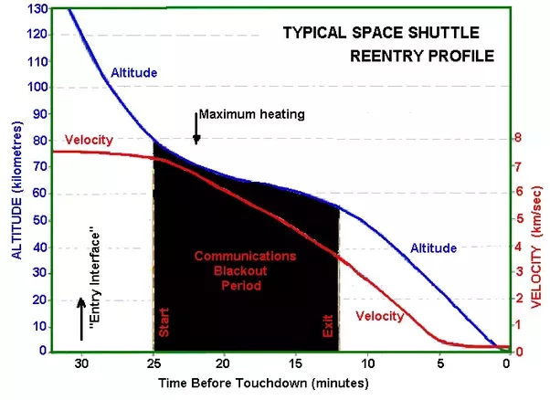

*Réponse publiée [sur Quora](https://fr.quora.com/Les-ailes-d-un-avion-envergure-survivrait-elle-%C3%A0-l-espace-Pourquoi-la-navette-spatiale-a-des-ailes-de-manchot/answer/Dr-Goulu)*

A l'espace oui, sans problème , on envisage de faire des [Voiles solaires](w:Voile_solaire) de plusieurs centaines de mètres, voire kilomètres.

Pour la [Rentrée atmosphérique](w:), c'est moins sur :

Le moment du "maximum heating" est celui où la navette freine le plus. Avec des ailes plus grandes elle freinerait encore plus, avec de plus grandes contraintes mécaniques sur la structure.

Et à quoi bon de grandes ailes ? Même avec ses "ailes de manchot", la [Finesse aérodynamique](w:Finesse_(aérodynamique)) de la navette spatiale est aux alentours de 4, un peu comme un parapente à l'atterrissage. Finalement, il n'y a jamais eu d'accident à l'atterrissage, mais à la rentrée oui …

En passant, vous savez à quoi correspond le "communication blackout" du graphique ? C'est expliqué sur [Reentry Blackout](https://www.spaceacademy.net.au/spacelink/blackout.htm) : la température de l'air autour de la navette est telle qu'il rayonne dans le domaine des ondes radio !
