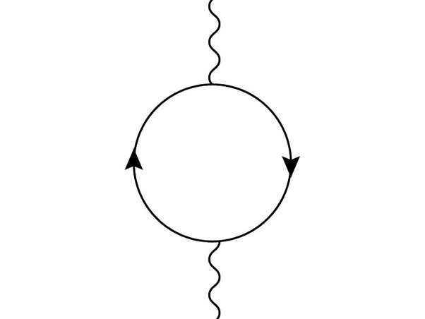

*Réponse publiée [sur Quora](https://fr.quora.com/Pouvez-vous-expliquer-simplement-comment-le-voyage-dans-le-temps-est-th%C3%A9oriquement-possible/answer/Dr-Goulu)*

"Simplement", c'est pas facile… mais j'essaie:

La [Relativité générale](w:) lie l'espace et le temps dans la notion d'[Espace-temps](w:). Cet espace-temps est déformé par des masses selon L'[équation d'Einstein](w:) (pas e=mc^2, l'autre, un peu plus compliquée…)

Cette équation admet de nombreuses solutions mathématiques différentes dont certaines possèdent des [Courbes fermées de type temps](w:Courbe_fermée_de_type_temps) (CTC en anglais).

Une telle courbe est une trajectoire ([ligne d'univers](w:) ) dans l'espace-temps qui a la propriété d'être fermée, c'est-à-dire qu'une particule matérielle qui suivrait cette trajectoire reviendrait à son point de départ dans l'espace ET dans le temps.

Le grand mathématicien [Kurt Gödel](w:) a proposé en 1949 une solution des équations d'Einstein nommée [Univers de Gödel](w:) qui correspond à un univers en rotation. Dans cet univers, les CTC sont très courantes, au point que le voyage dans le temps est quasiment inévitable. Hélas, nous ne sommes pas dans un Univers de Gödel.

En 1974, [Frank Tipler](w:) a montré qu'il n'y avait pas besoin que tout l'Univers tourne. Un cylindre infiniment long, et donc infiniment massif, et tournant très vite peut suffire à créer des CTC (oui, il y a un peu d'humour dissimulé dans cette phrase…)

Mais Stephen Hawking Himself a analysé cette solution et montré en 1992 qu'il fallait encore y ajouter un peu d'énergie négative ( voir [Tipler cylinder sur la Wikipedia en anglais](w:en:Tipler_cylinder))

Cette énergie négative est un ingrédient essentiel des [Trous de ver](w:Trou_de_ver), une autre solution des équations d'Einstein qui permet de créer une CTC en mettant une extrémité du trou de ver à un endroit (près d'un trou noir) ou à une vitesse (relativiste) qui fait que cette extrémité vieillit "moins vite" que l'autre. C'est l'idée du livre [Comment construire une machine à explorer le temps ?](/2006/06/16/comment-contruire-un-machine-a-voyager-dans-le-temps/) de [Paul Davies](w:Paul_Davies_(physicien)), la plus "réaliste" de machines à remonter dans le temps qu'on puisse imaginer pour l'instant. Elle a une caractéristique liée aux CTC qui explique pourquoi on ne voit pas de voyageurs temporels : elle ne permet de revenir qu'après la date de construction de la machine.

Tout ce qui précède est basé sur des solutions **mathématiques**aux équations d'Einstein. Mais :

1. Ce ne sont peut-être pas des [solutions](/2016/09/11/solutions-admissibles/) [**physiquement**](/2016/09/11/solutions-admissibles/)[admissibles](/2016/09/11/solutions-admissibles/). Notamment, on n'observe aucun phénomène lié à de grosses quantiés d'énergie négative, et sans énergie négative, pas de voyage dans le temps.
2. Pas dit qu'on puisse passer plus d'une particule dans une CTC, ni que la CTC puisse couvrir de longues périodes de temps.

Soyons clairs : Homo Sapiens ne fera pas de machine lui permettant de voyager dans le temps. La technologie nécessaire, si elle est possible, sera accessible après l'espérance de vie de notre espèce.

—— fin de la réponse "simple" —-

Mais je pense qu'il est vraiment important de faire des expériences pour savoir si les CTC sont possibles, donc pour savoir si nous vivons dans un [Univers-bloc](w:) (ou "growing bloc") ou dans un vecteur d'état quantique.

D'ailleurs là j'ai une question pour les physiciens de passage ([Hadrien Chevalier](https://fr.quora.com/profile/Hadrien-Chevalier) ): Comment distinguer:

