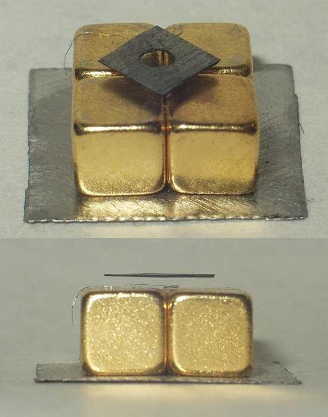

*Réponse publiée [sur Quora](https://fr.quora.com/Les-lois-de-la-physique-permettent-elles-la-l%C3%A9vitation/answer/Dr-Goulu)*

Oui. [Andre Geim](w:) a réussi à faire léviter une grenouille vivante avec un aimant de 10 Tesla (= extrêmement puissant):

[https://www.youtube.com/watch?v=...](https://www.youtube.com/watch?v=A1vyB-O5i6E)

Pour cette performance, il a reçu le [Prix Ig Nobel de Physique 2000.](https://www.improbable.com/ig-about/winners/#ig2000)

En 2010 il a reçu le Prix Nobel de Physique pour un truc presque aussi cool : le graphène.

C'est le seul chercheur a avoir reçu ces deux prix :-)

On peut faire léviter des matériaux d'autant plus facilement qu'ils sont [Diamagnétiques](w:Diamagnétisme), ce qui est le cas des organismes vivants, mais faiblement.

Le matériau le plus diamagnétique à température ambiante est le carbone pyrolytique (une variante de graphène, le monde est petit…). Il plane naturellement au dessus d'aimants:

Et il a une autre propriété incroyable que je vous laisse découvrir dans cet article:

[Le carbone pyrolytique, c'est fantastique - Pourquoi Comment Combien](/2014/03/15/le-carbone-pyrolytique-cest-fantastique/)
