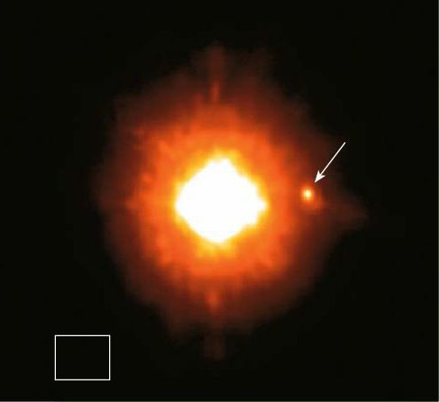

*Réponse publiée [sur Quora](https://fr.quora.com/Comment-observer-directement-les-exoplan%C3%A8tes/answer/Dr-Goulu)*

Avec des télescopes très puissants comme le VLT, on arrive à obtenir quelques pixels correspondant à d'énormes planètes (plusieurs fois Jupiter) gravitant autour d'étoiles peu lumineuses, pas trop loin.

On possède désormais plusieurs images de ce genre, qu'on peut analyser pour identifier la composition chimique des planètes :

source et autres images : [Les exoplanètes : 54 la première photo d'une exoplanète](https://www.science-et-vie.com/archives/les-exoplanetes-54-la-premiere-photo-d-une-exoplanete-24348)

Avec de très grands télescopes interférométriques, on ne désespère pas de pouvoir voir des exoplanètes plus petites. Théoriquement, avec de tels télescopes dans l'espace ou sur la Lune on devrait arriver à voir des continents ou des nuages sur une planète de la taille de la Terre, si elle est pas trop loin, et qu'elle en a…
