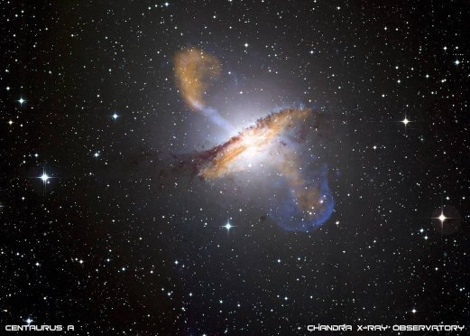

*Réponse publiée [sur Quora](https://fr.quora.com/Que-se-passerait-il-si-les-galaxies-navaient-pas-de-trou-noir-super-massif-%C3%A0-leur-centre-Ceci-nest-quune-simple-hypoth%C3%A8se-histoire-de-voir-ce-qui-se-passerait/answer/Dr-Goulu)*

Du point de vue gravitationnel, pas grand chose parce qu'un trou noir supermassif (TNS) ne représente que quelques pourcents de la masse totale de la galaxie au mieux. Ce n'est pas comme une étoile qui représente 99% de la masse de son système.

Par contre les TNS ont d'autres effets, comme d'envoyer une pluie de particules très loin dans leur galaxie via leur jets[[1]](#Hrawe)

([NGC 5128](w:en:Centaurus_A) photo nasa : les bulbes de gaz éjectés du noyau central sont bien visibles en haut et en bas de l'image)

Cependant il semble que certaines galaxies n'ont pas de trou noir central, et ça ne les empêche pas d'exister.

Notes de bas de page

[[1]](#cite-Hrawe)[Recyclage galactique - Pourquoi Comment Combien](https://www.drgoulu.com/2009/02/04/recyclage-galactique/)
