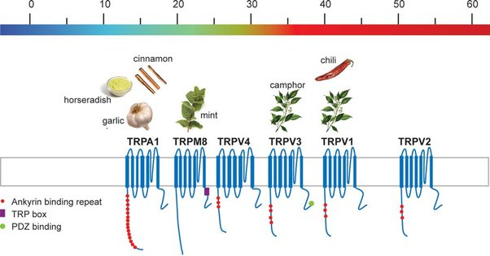

*Réponse publiée [sur Quora](https://fr.quora.com/Do%C3%B9-vient-la-sensation-de-froid-lorsquon-mange-un-bonbon-menthol%C3%A9/answer/Dr-Goulu)*

Le [Menthol](w:) réagit avec un récepteur de notre [canal ionique TRP](w:en:Transient_receptor_potential_channel), le TRPM8 qui nous signale qu’un aliment est agréablement frais. Notre bouche contient d'autres récepteurs TRP, sensibles à la température mais aussi à certaines molécules comme la capsaïcine des piments, qui active le TRPV1 :

Les aliments contenant ces molécules créent donc des "illusions thermiques" : vous pouvez manger tout le piment que vous voulez (ou presque), rien ne vous brûle réellement.

Il existe une molécule de synthèse, l' [Iciline](w:en:Icilin), qui produit une sensation de froid 200x plus puissante que le menthol. J'espérais qu'elle permette de faire des glaces chaudes, mais j'attends toujours …

[Molécules d'été et divers - Pourquoi Comment Combien](https://www.drgoulu.com/2010/08/01/molecules-dete-et-divers/)
