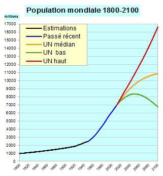

*Réponse publiée [sur Quora](https://fr.quora.com/Au-rythme-actuel-quand-les-scientifiques-sattendent-ils-%C3%A0-ce-que-les-humains-disparaissent/answer/Dr-Goulu)*

Le rythme actuel, c'est 2.64 humains de **plus**chaque seconde[[1]](#BGOaY) . A ce rythme là, pas question de disparaître, on va plutôt avoir besoin de nouvelles planètes assez vite…

Heureusement, selon certains scénarios la population devrait s'équilibrer autour de 11 milliards d'habitants à la fin du siècle, voire décroitre un peu .

Sinon, au rythme passé des disparitions d'espèces d'[Homo](w:), Homo Sapiens en est statistiquement à peu près au milieu de la durée d'une espèce humaine, donc on en a encore pour 200 à 300'000 ans

Notes de bas de page

[[1]](#cite-BGOaY)[COMPTEUR - Compteur de la population mondiale en temps réel 2019 ⏲️](http://www.compteur.net/compteur-population-mondiale/)
