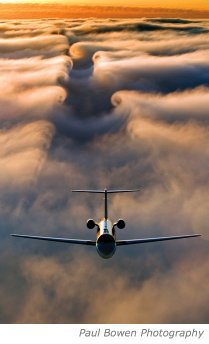

*Réponse publiée [sur Quora](https://fr.quora.com/Comment-un-avion-forme-t-il-une-turbulence-dans-son-sillage-Et-comment-l%C3%A9viter/answer/Dr-Goulu)*

Un avion vole en propulsant de l'air vers le bas[[1]](#krHDi) et vers l'arrière avec des hélices ou réacteurs.

Ces deux phénomènes créent une dépression derrière l'avion, qui crée un appel d'air. Turbulent en raison du [Nombre de Reynolds](w:), principalement lié à la vitesse de l'avion.

(la plus belle photo d'un sillage d'avion que je connaisse)

Pour ne pas créer de turbulences, il faut un très grand avion très léger volant très lentement.

Notes de bas de page

[[1]](#cite-krHDi)[Portance : pourquoi ça vole ? - Pourquoi Comment Combien](https://www.drgoulu.com/2012/03/11/portance-pourquoi-ca-vole/)
