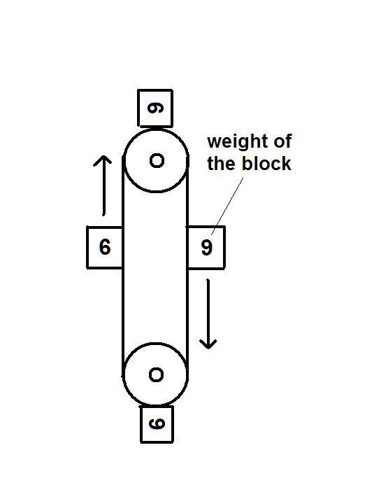

*Réponse publiée [sur Quora](https://fr.quora.com/Est-ce-qu-un-syst%C3%A8me-qui-laisse-des-boules-remplies-d-air-remonter-en-haut-d-un-r%C3%A9servoir-d-eau-et-descendre-%C3%A0-cot%C3%A9-du-r%C3%A9servoir-pourrait-g%C3%A9n%C3%A9rer-un-mouvement-perp%C3%A9tuel/answer/Dr-Goulu)*

Aussi bien que celui-ci, qui est beaucoup plus simple :

[Dites NON au mouvement perpétuel](https://www.drgoulu.com/2012/05/27/dites-non-au-mouvement-perpetuel/).
