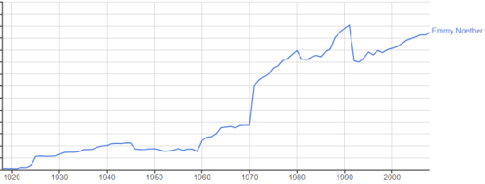

*Réponse publiée [sur Quora](https://fr.quora.com/Qui-a-trouvé-le-mouvement-perpétuel/answer/Dr-Goulu)*

[Le Théorème de Noether a un siècle](/2018/06/23/le-theoreme-de-noether-a-un-siecle/#.Xfqc60dsOCo), mais il n'est devenu "à la mode" que depuis les années 1970 , peut-être quand un public plus large que les matheux ou les physiciens théoriciens l'ont compris.

(mentions de Emmy Noether dans les livres selon Google NGram)

La conservation de l'énergie est périodiquement remise en question, par exemple maintenant avec l'énergie noire qui accélère l'expansion de l'Univers… Comme toujours il faut bien comprendre les hypothèses utilisées par le théorème. La question de savoir si l'Univers est un "système fermé" ou si la physique est totalement lagrangienne ou hamiltonienne reste ouverte (je crois…), mais à notre échelle elle semble bien l'être.
